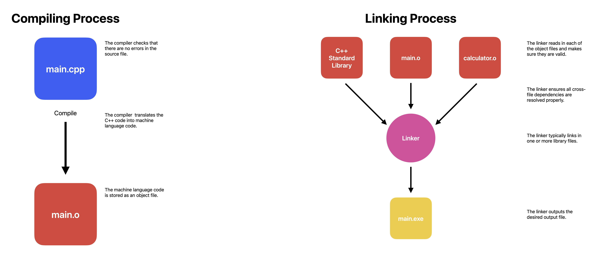

# Introduction

--- 

### Programs and Programming Languages

A **computer program** is a sequence of instructions that directs a computer to perform certain actions in a specified order.

When a computer is performing the actions described by the instructions in a computer program, we say it is **running** or **executing** the program.

**Software** refers to the programs on a system that are designed to be executed on hardware.

The term **platform** refers to a compatible set of hardware and software that provides the environment for software to run on.

A program that can be easily transferred from one platform to another is said to be **portable**.

A computer's CPU is only capable of processing instructions written in **machine language**. 

Here is a sample machine language instruction: ```10110000 01100001```.

Each instruction is composed of a sequence of 1s and 0s. Each individual 0 or 1 is called a **binary digit**, or **bit** for short.

An **assembly language** is a programming language that essentially functions as a more human-readable machine language.

Example machine language ```10110000 01100001``` translated to assembly language ```move al, 0x61```.

An **assembler** is a program that translates assembly language into machine language.

Each CPU family (formally known as an "instruction set architecture" or "ISA") has its own machine language and its own assembly language.

Machine languages and assembly languages are considered **low-level languages**.

**High-level languages** include C, C++, Pascal, and Java.

Much like assembly programs, programs written in a high-level language must be translated into a machine language before they can be run.
There are two primary ways this is done: compiling and interpreting.

C++ programs are usually compiled. A **compiler** is a program that reads the source code of one language and translates it into another language.
For example, a C++ compiler translates C++ source code into machine code.

The machine code output by the compiler can then be packages into an executable file.

An **interpreter** is a program that directly executes the instructions in the source code without requiring them to be compiled first.

Interpreters tend to be more flexible than compilers, but are less efficient when running programs because the interpreting process needs to be done every time the program is run.
This also means the interpreter must be installed on every machine where an interpreted program will be run.

High-level languages allow programmers to write programs without knowing much about the platform it will be run on.

A program that is designed to run on multiple platforms is said to be **cross-platform**.

Programs written in a high-level language are easier to read, write, and learn because their instructions more closely resemble the natural language and mathematics that we use every day.

---

### Introduction to C/C++

C was developed in 1972 by Dennis Ritchie at Bell Telephone laboratories.

C++ was developed by Bjarne Stroustrup at Bell Labs as an extension to C, starting in 1979.

C++'s most notable innovation over C is that it supports object-oriented programming.

Standardized in 1998 by the ISO committee. 
The goal of standardization is to help ensure that C++ code behaves consistently across different compilers and platforms.

**What is C++ good at?**

C++ excels in situations where high performance and precise control over memory and other resources is needed.

A few types of applications that C++ would excel in:
- Video Games
- Real-time systems
- High-performance financial applications
- Graphical applications and simulations
- Productivity / office applications
- Embedded software
- Audio and video processing
- Artificial intelligence and neural networks

---

### Introduction to C++ Development

The C++ development process:
1. Define the problem to solve
2. Design a solution
3. Write a program that implements the solution
4. Compile the program
5. Link object files
6. Test program
7. Debug (repeat steps 4-7 as needed)

**Step 1: Define the problem that you would like to solve**

This is the **"what"** step where you figure out what problem you are intending to solve.

Examples: 
- "I want to write a program that will allow me to enter many numbers, then calculates the average."
- "I want to write a program that generates a 2d maze and lets the user navigate through it. The user wins if they reach the end."
- "I want to write a program that reads in a file of stock prices and predicts whether the stock will go up or down."

**Step 2: Determine how you are going to solve the problem**

This is the **"how"** step, where you determine how you are going to solve the problem you came up with in step 1.

Typically, good solutions have the following characteristics:
- They are straightforward (not overly complicated or confusing).
- They are well documented (especially around any assumptions being made or limitations).
- They are build modularly, so parts can be reused or changed later without impacting other parts of the program.
- They can recover gracefully or give useful error messages when something unexpected happens.

**Step 3: Write the program**

In order to write the program we need two things:
1. Knowledge of a programming language.
2. A text editor to write and save our C++ programs.

The set of C++ instructions that we input into the text editor is called the program's **source code**.

Each source code file in your program will need to be saved to disk.

Name the first/primary source code file in each program ```main.cpp```.

**Step 4: Compiling your source code**

In order to compile C++ source code files, we use a C++ compiler.
The C++ compiler sequentially goes through each source code file in your program and does two important tasks:
1. Checks your C++ code to make sure it follows the rules of the C++ language. If it does not, the compiler will give you an error. The compilation process will also be aborted.
2. Translates your C++ code into machine language instructions. These instructions are stored in an intermediate file called an **object file**.

Object files are typically named *name.o* or *name.obj*, where name is the same name as the .cpp file it was produced from.

**Step 5: Linking object files and libraries and creating the desired output file**

After the compiler has successfully finished, another program called the **linker** kicks in.
The linker combines all of the object files and produce the desired output file.
This process is called **linking**.
If any step in the linking process fails, the linked will generate an error message and then abort.
1. The linker reads in each of the object files generated by the compiler and makes sure they are valid.
2. The linker insures all cross-file dependencies are resolved properly.
If you define something in one .cpp file, and then use it in a different .cpp file, the linker connects the two together.
If the linker is unable to connect a reference to something with its definition, you'll get a linker error, and the linking process will abort.
3. The linker typically links in one or more **library files**, which are collections of precompiled code that have been "packaged up" for reuse in other programs.
4. The linker outputs the desired output file.
Typically this will be an executable file that can be launched.



C++ comes with an extensive library called the **C++ Standard Library** that provides a set of useful capabilities.
One of the most commonly used parts of the C++ standard library is the Input/Output library.

You can optionally link **third party libraries**, which are libraries that are created and distributed by independent entities.

The term **building** is often used to refer to the full process of converting source code files into an executable that can be run.
A specific executable produced as the result of building is sometimes called a **build**.

**Steps 6 and 7: Testing and Debugging**

Once you can run your program, then you can test it. 
**Testing** is the process of assessing whether your software is working as expected.
Basic testing typically involves trying different input combinations to ensure the software behaves correctly in different cases.

If the program does not behave as expected, then you will have to do some **debugging**, which is the process of finding and fixing programming errors.

---

### Compiling Your First Program

Create a new project in your IDE

Hello World

```C++
#include <iostream>

int main()
{
	std::cout << "Hello, world!";
	return 0;
}
```

A **console project** means that we are going to create programs that can be run from the console.

What is the difference between the compile, build, rebuild, clean, and run/start options in my IDE?

- **Build** compiles all *modified* code files in the project, and then links the object files into an executable produced.
- **Clean** removes all cached objects and executables so the next time the project is built, all files will be recompiled and a new executable produced.
- **Rebuild** does a "clean", followed by a "build".
- **Compile** recompiles a single code file. This option does not invoke the linker or produce an executable.
- **Run/start** executes the executable from a prior build.

---

### Build Configurations – Configuring your Compiler

A **build configuration** is a collection of project settings that determines how your IDE will build your project.

Typically includes things like:
- What the executable will be named
- what directories the IDE will look in for other code and library files
- whether to keep or strip out debugging information
- how much to have the compiler optimize your program
- and more

When you create a new project in your IDE, most IDEs will set up two different build configurations:
1. a release configuration
2. a debug configuration

A **debug configuration** is designed to help you debug your program and generally the one you use when writing your programs.

The **release configuration** is designed to be used when releasing your program to the public.

Best Practice: Use the *debug* build when developing your programs.
When you're ready to release your executables to others, or want to test performance, use the *release* build configuration.

### Compiler Extensions – Configuring your Compiler

The C++ standard defines rules about how programs should behave in specific circumstances. 
In most cases, compilers will follow these rules.
However, some compilers will implement their own changes to the language, often to enhance compatibility with other versions of the language.
These compiler-specific behaviors are called **compiler extensions**.

Writing a program that makes use of a compiler extension allows you to write programs that are incompatible with the C++ standard.
Programs using non-standard extensions will not compile on other compilers, or may not run correctly.

Compiler extensions are often enabled by default.
Because compiler extensions are never necessary, and cause your programs to be non-compliant with C++ standards, it is recommended to turn them off.

Best Practice: Disable compiler extensions to ensure your programs remain compliant with C++ standards and will work on any system.

---

### Warning and Error Levels – Configuring your Compiler

When the compiler encounters some kind of issue it will emit a **Diagnostic message**.

A **diagnostic error** means the compiler has decided to halt compilation, because it either cannot proceed or deems the error serious enough to stop.
Diagnostic errors generated by the compiler are often called **compilation errors**, **compiler errors**, or **compile errors**.

A **diagnostic warning** means the compiler has decided not to halt compilation.

**Best Practice:** Don't let warning pile up. 
Resolve them as you encounter them. 
Otherwise a warning about a serious issue may be lost amongst warnings about non-serious issues.

**Increasing your warning levels**

**Best Practice:** Turn your warning levels up, especially when you are learning. 
The additional diagnostic information may help in identifying programming mistakes that can cause your program to malfunction.

**Treat warnings as errors**

**Best Practice:** Enable "Treat warnings as errors".
This will force you to resolve all issues causing warnings.

